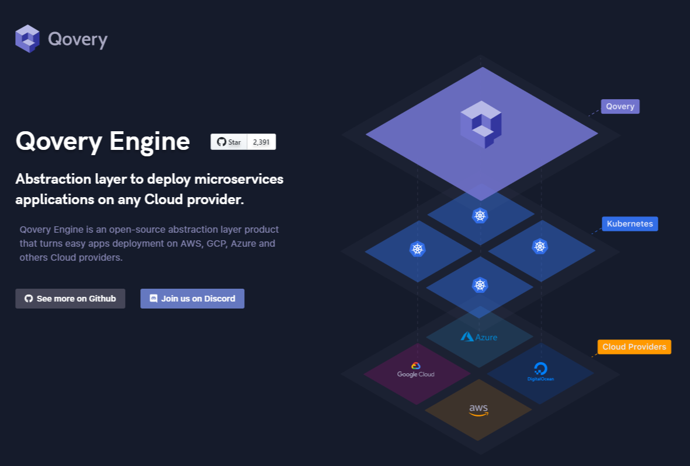

# Qovery Engine

Objectif: Suite au livestream de benjaminCode [Codons ensemble](https://www.youtube.com/watch?v=f1kC1785aGs),j'ai voulu réaliser à mon tour cette petite maquette afin de m'initier aux animations de page en css.
Challenge done!

```tweet_embed(benjamincodeYT,1347514621704478723)
```

> Technos: HTML/CSS/JS

> Outil utilisé: Figma




