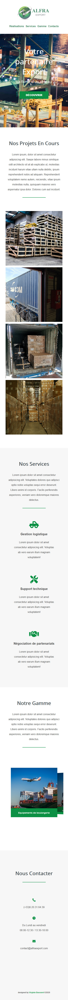
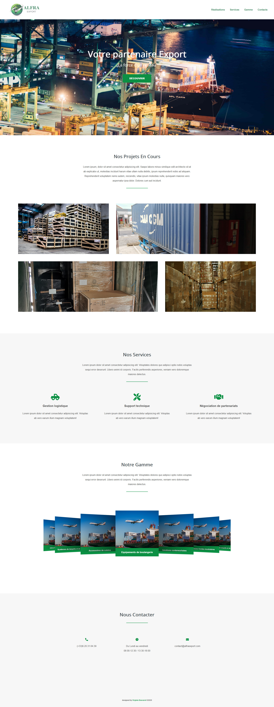

### Live version [here](https://virginiebouvarel.github.io/integrations/alfra/).

# Alfra Export Landing Page

## Détails

> Technos utilisées : HTML/CSS

Pour ce projet mon objectif était de réaliser une landing page pour la société Alfra Export dont le pdg est une de mes connaissances. Cette intégration est une ébauche pour permettre au client d'avoir une idée du type de sections possibles et des contenus qui devront être crées et rassemblés pour établir un réel site à l'avenir.  

Dans ce projet j'ai appris...
- à réaliser un slider avec la librairie Swiper.js
- que concevoir une simple landing page à de réelles fin marketing n'était pas si évident
- qu'un client pouvait n'avoir aucune idée de ce qu'il voulait pour son site et que le développeur pouvait être amené à guider toute la conception
  

## Versions mobile et desktop
 
  