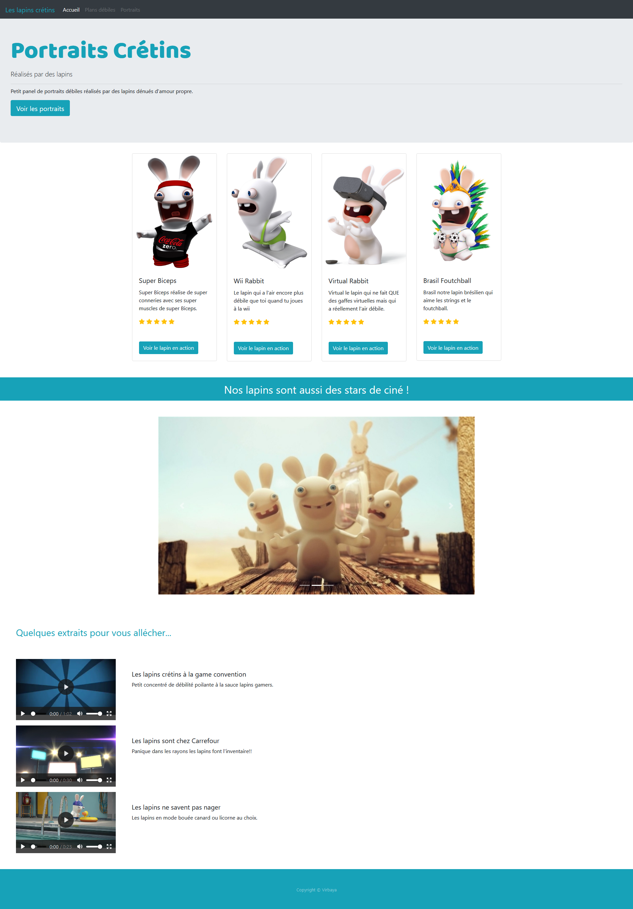

### Live version [here](https://virginiebouvarel.github.io/integrations/crazyrabbits).

# Crazy rabbits page - Bootstrap sandbox

## Détails

> Technos utilisées : HTML/BOOTSTRAP 

Pour ce projet mon objectif était de réaliser une simple page avec Bootstrap, pour découvrir ses différentes fonctionnalités et classes de base.  
