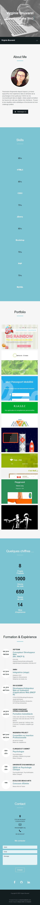
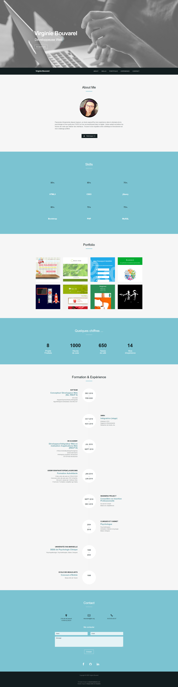

### Live version [here](https://virginiebouvarel.github.io/integrations/cv_bootstrap_softeam/).

# CV Bootstrap avec utilisation de templates

## Détails

> Technos utilisées : HTML/BOOTSTRAP

Pour ce projet mon objectif était de découvrir l'utilisation des templates Bootstrap en réalisant un CV dans le cadre d'une formation. Le challenge ici, était de jouer le jeu du "template" en parvenant à réutiliser le code d'un autre développeur. J'ai fait le choix de mixer 2 templates. L'un pour la structure et le style qui me convenait, l'autre pour des fonctionnalités absentes du premier, comme l'affichage dynamique des métiers.
Dans ce projet je n'ai donc écris aucune ligne de code. La difficulté a été de réussir à comprendre un code inconnu et complexe pour arriver à séléctionner seulement certaines parties et à les insérer là où il fallait pour que le tout continue de fonctionner.  

Avec ce projet j'ai appris...
- à utiliser un template
- à déchiffrer un code écrit par un autre développeur
- à intégrer des morceaux de code tiers dans ma codebase
  

## Versions mobile et desktop
 

 