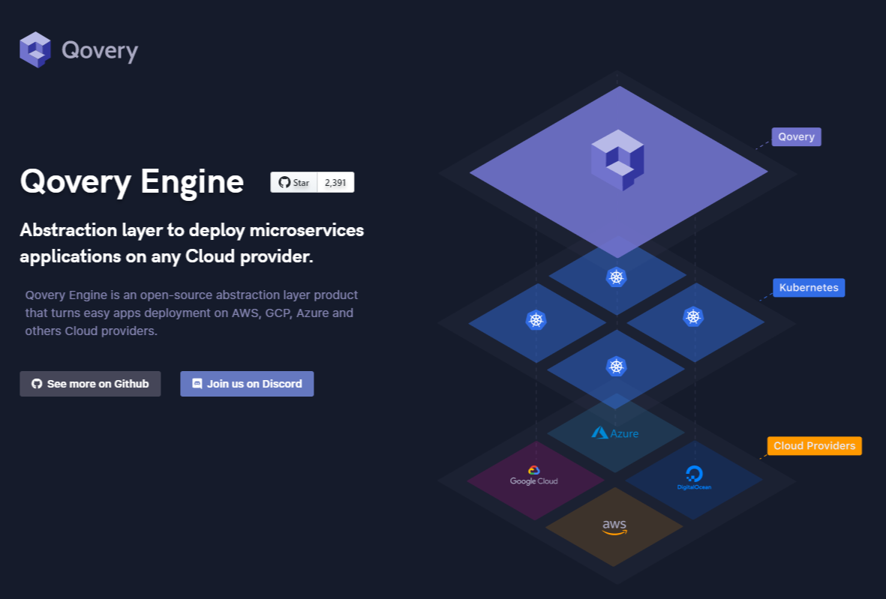
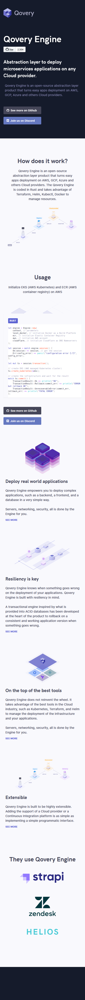
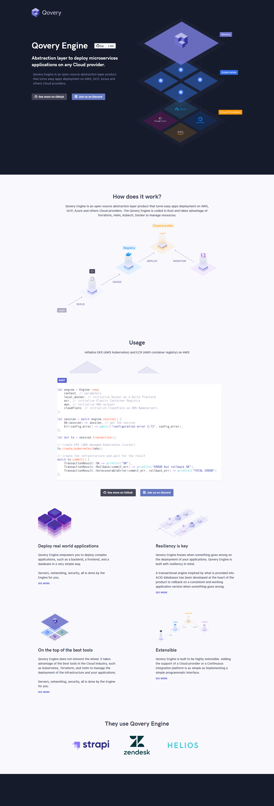

### Live version [here](https://virginiebouvarel.github.io/integrations/qovery/).

# Qovery Engine

## Détails

> Technos utilisées : HTML/CSS/JS/Figma

Pour ce projet mon objectif était d'intégrer la maquette que [BenjaminCode](https://www.youtube.com/channel/UCLOAPb7ATQUs_nDs9ViLcMw) avait lui_même réalisée dans son [livestream](https://www.youtube.com/watch?v=thGgzJ0Kfz0) twitch du 21/12/2020, afin de m'initier aux animations de page en css.  

Avec ce projet j'ai appris...
- à réaliser mes premières animations de page en css
- que le développeur front pouvait concevoir entièrement la partie responsive d'un site 

  

## Versions mobile et desktop
 

 